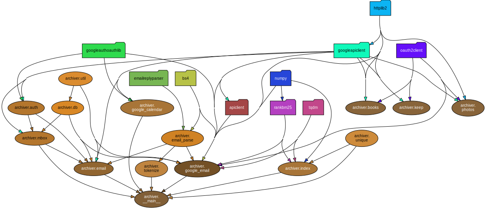
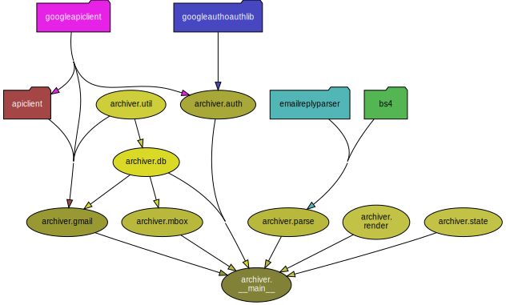

At work, I've started working on a new code base.  This has me thinking about the best way do this.
Code can sometimes be a real pain.  You aren't just inheriting all the good stuff, you also take on
all of the short cuts and half finished features that make up the technical debt of the project.  A
new code base is a package, you don't get to choose only the good parts.  So where to start?

<!--more-->

Sometimes code can be intimidating, if not outright scary.  Why is that?  As the new owner of the
code, you may be required to add features, fix bugs, or solve complex problems.  Worse, you might be
asked to do this in the middle of the night if you're on call.  So yes, something to consider.  I
really don't like living this way, so I've been thinking of ways of relating with my work
that are more positive. The feelings I enjoy most about my code is the sense of a job well done.
There's an aesthetic beauty to code, that you can only see once you've wrapped your head around it.
Sometimes that feels like awe.  Before my time, there were people who called themselves "craftsmen".
They took great care in the quality of their work.  Some took it to the point of obsession.  It's
not a cultural value that lives on today unfortunately.  Perhaps we can revive it.  At the end of
the day, I want to love my work.

Sometimes I wonder what it is that I'm creating.  You'd think it would be obvious.  But software has
a way of morphing into things beyond comprehension.  In software, we build these enormously complex
machines, constantly being worked on by many people.  The direction shifts depending
on the needs of the company and the users of the software.  It's not a surprise that things can turn
into a mess.  But how that complexity shapes itself is in part the expression of the developers
working on it.   Software that's neglected or worked on carelessly, turns into a Rube-Goldberg.
But careful attention and experience can create a beautiful work of art that's a pleasure to
maintain well into the future.  I'm going for the art.  But just for comparison, let's
look at a Rube-Goldberg machine here:

Now let's compare this with some of the work I saw a few years ago at the [Miniature Engineering
Craftsmanship Museum in Carlsbad](https://craftsmanshipmuseum.com/artisan/young-c-park/).
Here's a picture of a custom made radial model airplane engine. I find this so beautiful.

Both are complex and achieve their purpose, but one has this sense of purpose and cohesion that
stirs something in the soul.

[Here's taste of this sense of craftsmanship from the Museum website:](https://craftsmanshipmuseum.com/artisan/young-c-park/)

> Every part of Young's planes were completed to his personal satisfaction. He built them solely by his own standards and expectations. Mr. Park didn’t build these masterful miniatures for entry in shows or contests. He noted that it was less important that the parts be technically perfect, so long as they "look and fit right." With cutaway sections on some of these incredible miniatures, viewers can see that making these complicated parts come together is true artistry.

While I might not have the luxury of completing my work projects to my personal level of
satisfaction, that's definitely something I can do with my own personal code.

I started going through some of my old code that I still use.  I have for example some code I use to
download emails from Gmail to my desktop so they can be archived and searched locally.  I have grand ambitions
for all of that data, but for now it's just a Python CLI that accesses Gmail and syncs with a
local database.  It was written over a weekend, and then one late night I got the
great idea of adding a search engine to it.  That didn't end very well, and the code was left in a messy state.
I had added a number of extra libraries to help with the search functionality, which made it
really difficult to just do the simple operation of syncing my data.  Just installing the
dependencies was causing problems.  It was definitely time for a refactor.  So I used this as an
exercise in taking a new look at old code.  What would it take to give it a makeover?

As I went through the process, I made a list of the things I did to clean it up.  And while the end
product still had some major issues, the code itself was clean enough to inspire good feelings.

I will discuss the steps I went through to get there.  I think they are good model to follow if
faced with code that fills you with dread.

## Visualize and Revise Dependencies

**Use a dependency visualization tool and take a look at what modules are importing.**

Be sure to take a snapshot of what your code looks like before you start, so you have something to compare your work against.  It’s a very satisfying feeling to see your graph simplify and start to make sense.  Here's my before diagram:

**Before**

Some things to look for:

- From the graph, do the imports make sense?
- Do all of the modules belong together, or should they be split up?  Sometimes you have code that does very different things. They should not be grouped together, or share too many dependencies.  You can see this sort of thing from the dependency chart.
- Does it look like a mess?  What would clean it up?  By just moving things around, you can really clean up the graph.
For example, do all of those modules need to import from the database module?  Investigate and find out why.  By chasing down these messy leads, you can very quickly unravel your code.
- Remove anything that doesn’t belong in the module.  It might be unfinished code, or code related to something else that is no longer needed.  That code can be moved into a separate module, or just deleted.  In my archiver code, there are a number of modules unrelated to Gmail.  The Calendar and Photos modules are unfinished, so I have moved these into a separate project.
- Reorganize the modules such that the imports and dependencies for each module make sense.  If you're importing something that seems out of place, find out why.
- If the purpose of a module isn’t clear, this is a good time to make that clear.  What does this module do?  What belongs, and what doesn’t belong?  You might have to create new modules to contain code that doesn’t fit.  For this project I eliminated a number of modules, but I also created some new ones.  Mostly this was just breaking up modules that were doing too many things, revealing their purpose more clearly.
- Are module names vague or meaningless?  Names such as "util", "data", or "common" are terrible names that express what they do.  Shared functions littered through the code can sometimes be suspect, so make sure their interfaces are stable, and consider moving them to another project if they really are generic enough to be shared.  I have a "util" module with some code for dealing with primary keys and converting between formats.  This could definitely be named better.
- Does this module diagram help me make sense of the code?  What would help?

At this stage, we don’t want to make any major changes. We are just moving things around, renaming things, removing unnecessary dependencies, and adding new ones to make things clearer from a high level perspective.  The emphasis here is on high level comprehension.  We will want to keep this perspective in mind as we perform other remediation steps.

Here's my after diagram, looking much more sane.

**After**

I did a little research an found some tools that work for the languages I use most.  Here they are:

### Golang Tools
- https://github.com/lucasepe/modgv

### Python Tools
- https://github.com/thebjorn/pydeps

### Rust Tools
- https://github.com/regexident/cargo-modules
- https://git.sr.ht/~jplatte/cargo-depgraph

## Update the README

One thing I noticed on my sus' projects was that the README was terrible.  Either it didn't exist, it didn't contain any useful information, or worse, it was totally out of date and didn't represent the project at all.
The README might seem
like something for "other people", but I've found that it helps me a lot when I'm coming back to
code I haven't touched in a while.  It's a great reminder of what I was thinking.   The README
should be the last thing you touch after working with the code, and the first thing you touch when
you pick it up again.

Simple things are helpful:

- Background knowledge that might be helpful, providing useful resources to get the user familiar with the problem space.
- Video walk-through.  Instructional videos can also be very helpful for some developers, or managers who will never actually run your code, but they can watch the video and see it in action.  A quick demo can really help someone understand what it does at a high level.  You might already have done a walk-through of the code with other developers on your team.  You can record it and post a link here.
- Required dependencies
- Installation procedures
- High level diagrams
- An explanation of the directory structure
- How to run the code
- How to test and develop the code.  What is the workflow?
- What are some things you can do with the code? Are there examples? Examples are the best way to explain your code.
- What is the vision of the project?  Non-goals?
- What is on the roadmap?
- How to deploy to production

This doesn't have to be a formal thing.  Just helpful notes for the next person who comes along.
Most likely that will be you.  I see code all of the time on GitHub that looks very interesting,
but I have no idea what state it's in.  Is this a work in progress?  Is this ready for production?
What is the plan here?  If you're going to make something public, the least you can do is put in a
README that says, "Use at your own risk".

I always over-estimate my ability to remember things.  As I've grown as a developer, one of the best
skills I've acquired is knowing the kinds of things I will likely forget. That's the sort of information that belongs
here.

## Tests must pass

Run all tests and make sure they pass.

This should go without saying, but tests will often break a few months down the line as dependencies
change.  Some languages are worse than others for sure.  It's a good sanity check to ensure your
code builds and tests pass.  Bonus points if you have a CI job that builds your job weekly.
GitHub can do this for free.  Not every code base needs this.  But if it's something you use or
depend on, consider automating those tests.

Broken tests also point to problems in your code.  This is a good time to eliminate useless tests,
or to clean things up that aren't clear.  Coming into a new code base with a fresh set of eyes can
really help you zero in on the issues.  Even if you don't have time to address them, make notes in
the README, or leave a TODO in the code.

## Use a linter

**Turn on linters and track cyclomatic complexity.**

I find linters really helps clean things up.  I can't believe the
problems linters find.  Often bugs are uncovered, and it draws my attention to the parts that can
really use some help.  Take advantage of this automated tool.   Of course, not all lints are
helpful.  But no linter is definitely _not_ helpful.  So turn the linter on and let it help you.

You can disable unhelpful lints using the configuration file.

If you find some code that really needs attention, and you don't have time to get to it, make notes
in the code about what you're thinking.  It will save you time later.  Don't just disable the lint
because you don't have time.  It's better to leave the lint on, so it will bring you back to that
part of the code again in the future.

Once your code is lint free, add a lint step to your CI, or a pre-commit hook that will fail if lints are present.  It's a nice bar to set, and will keep things clean going forward, especially if there are other developers on the project.

Cyclomatic complexity can draw your attention to areas that might be needlessly complex.
Cyclomatic complexity however is not a good objective measurement, so you should take it with a
grain of salt.  You can use it to find a baseline that you’re comfortable with on your project,
and then use your linter to set up a maximum.

Here are some tools I found helpful:

### Golang
- https://github.com/fzipp/gocyclo

### Python
- https://pypi.org/project/mccabe/

### Rust
- https://github.com/rust-lang/rust-clippy

## Refactor notoriously difficult to read code

As I've gone through the code so far, I usually start to notice things.  Classes that don't make
sense, or don't have a clear purpose.  Code that hard to comprehend.  Code that's most likely
broken.  Now is a good time to dig in and take a look.  When I was doing my cleanup, I was specifically looking
to refactor code that would help me clarify things at a high level.  I wasn't changing how things
work, just trying to get cleaner interfaces.  On the archiver, I created some classes that
helped simplify a lot of the functions I was using.

Be on the look out for:
- Deeply nested for loops, or nested logic statements
- Double negatives.  Try to ensure all functions that return booleans, do so in the affirmative.
It’s not always clear what the affirmative actually means, but it can help clarify the intention of
the code.
- Complicated boolean logic.  Long strings of boolean operators are almost impossible to figure out
at a glance.  Lots of bugs hide in there. For complicated logic, I often accompany the difficult
code with a truth table in the comments to make absolutely sure I have covered all of the cases properly.  I have found a lot of bugs this way.
- Anything else that makes you stop and say "What?".

## Eliminate errors and noise from your logs

One thing I find very annoying when I inherit new code, is seeing lots of errors in the production
logs.  If I'm on call and I redeploy the code, how do I know if something is working or not?  How
can I find a new error, when there are so many already?  This sort of low signal to noise ratio is a
great pain, and is a sign of neglect.

Here are some opinionated tips for logging:

- It’s fine to have verbose logging, but make sure that those messages are flagged as debug.
- Info messages should actually be informative and low frequency.
- Error messages should be unexpected and actionable.  Things like timeouts on a high volume system are just part of doing business.  You don't want to ignore these of course.  A lot of errors can be turned into metrics, counted and visualized in a dashboard.  From there you can determine a normal rate and create an alert if things get out of line. It's much easier to notice a problem with a frequency spike on a dashboard than in the logs.  Errors should indicate that there is a major problem and to consider reverting the deploy.

Taking these actions will greatly reduce the noise in your logs.  There’s nothing more annoying that deploying your code and seeing a bunch of errors that have nothing to do with your code.  It really adds to the stress of the job.  If an error shows up, that should mean what it says, "ERROR" and your your code is not ready to be deployed.  Fix the error first if you can.  Alternatively you can track your errors in Sentry, and start tackling them one by one as you find time.

Errors are important, but if they get lost in the logs, they lose their value.  Chasing down this noise will bring you to code that can really use some more attention, and you will likely find bugs.  Sometimes it’s just errors that need to be handled explicitly and tracked as metrics.

# Conclusion

I will probably add to this list in the future, but this was all I did.  It took me an hour or so
for each code base I touched, and it was a surprisingly good use of my time considering the
  results.  I can honestly say I feel better about my creations after taking this "craftsman" look at
  my work.

